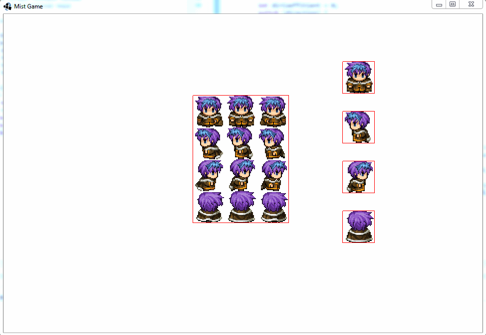

mist
====

Обновленный код для DesktopLauncher.java

```java
public class DesktopLauncher {
	public static void main (String[] arg) {
		LwjglApplicationConfiguration config = new LwjglApplicationConfiguration();
		config.width = MistGame.getWidth();
		config.height = MistGame.getHeight();
		config.title = MistGame.GAME_TITLE;
		new LwjglApplication(new MistGame(), config);
	}
}
```
<i>prepare5.2</i> commit preview

